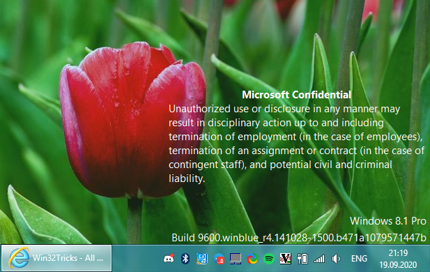

# Adding back the "Microsoft Confidential" watermark into Windows 8.1

#### by [Veselcraft](https://github.com/veselcraft)

#### [🗞 Back to Articles](https://win32tricks.github.io/articles)

As you know, in Beta builds of Windows 8 there was a watermark that says about confidentiality of this build to warn a developer or tester to not leak this build to other sources. So can we bring back this watermark to the final release of Windows? **Yes**, and i will show how can you do this.

So, for this trick you need to get [9600.17024's](https://betawiki.net/wiki/Windows_8.1_build_9600.17024) `shell32.dll` and `shell32.dll.mui`, and [Resource Hacker](https://www.angusj.com/resourcehacker/) to path `mui` file.

**Get the MUI file** from `Windows/system32/*language you have installed*/shell32.dll.mui` **from both copies of Windows** and open one file **from computer you want modify in Resource Hacker**. Select the "String Table" folder and press **"Create Resources from Blank Script"** in toolbar (it's blank file with plus icon). As you pressed, **open another instance of Resource Hacker and open the 9600.17024's `shell32.dll.mui`**. Open the "String Table" folder and go down for `3876 : 1033` resource. **Copy the contents** of this resource and **paste this to blank script you created**. Press **F5** and go to the "Dialog" folder in 9600.17024's file. Open the `14352 : 1033` resource and **copy all content** and **paste** to the same resource, but now of **non-beta MUI**. Finnaly, **save this on your desktop** or on USB drive and **restart to the Command Prompt** by pressing shift when you click on the "Restart" button.

Firstly, **rename the original files** with `rename` command to `shell32b.dll` **(it's important to rename dll like that!)** and `shell32.dll.mui.backup`. Secondly, **copy the `shell32.dll` from your beta build and our modified `shell32.dll.mui`**. Thirdly, open `regedit`, open HKLM and **Load the Hive** from `Windows\system32\config\system`. Open "CurrentControlSet" or "ControlSet001", `Control\Session Manager\KnownDLLs`, **find the `SHELL32`** and change his parameter to "SHELL32b.DLL". **Unload the hive**, by selecting the folder of loaded hive, **and restart**. **And you are done!**